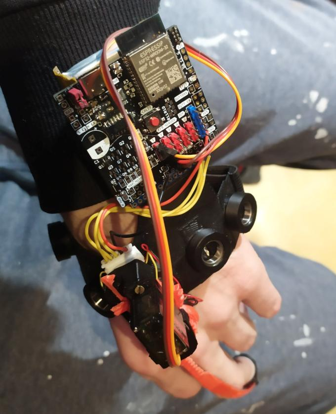
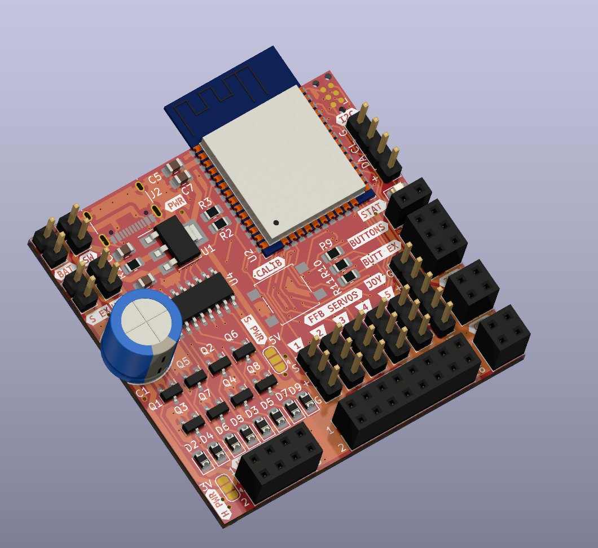

This is a PCB designed to be used with the  [LucidVR glove](https://github.com/LucidVR/lucidgloves) (prototype 5).

	
	 

The main advantage is that it reduces a lot of wiring spaghetti and loose wires one has to normally deal with, when using breadboards. It also makes the whole thing smaller. 

Please note that this PCB uses mainly SMD (surface mounted) components, some of which are not trivial to solder, thus if you have no experience soldering SMD components, then make sure you take this into account. The size used for standard components like resistors and capacitors is 0805. The size of the pcb is approx 5x5cm.

Programming is done through a footprint that accepts a spring loaded connector, and then loads the code in thorugh a serial interface. However, if you don't have the connector, you can solder wires directly to the pads and run them to some sort of usb -> serial convertor, like FTDI, or Arduino Uno. 

Features:
- Supports up to 5 servos for force feedback, they can be plugged directly in.
- Supports up to 16 hall sensors via muxing, allowing for both curl and splay support (with splay you need 15 halls per hand)
- Supports up to 8 custom buttons
- Supports joystick (X/Y axes + button)
- Power select for servos (via solder jumper), either power them from input power (usually 5V USB bank) or from external power supply you can connect.
- Power select for haptic motor  (via solder jumper), either power the on-board linear regulator, or from external power supply you can connect.
- Support for up to 8 haptic motors, which can be controlled via PWM through a 74HC595 shift register, to set the intensity of the vibration. Ideally, you would use coin cell motors [like these](https://www.aliexpress.com/item/1005003987941308.html). You can attach them to the fingertips allowing you to "touch" things in VR. Please note that at the moment haptic feedback is officialy not supported by proto 5 (as far as I know) so appropriate modification of the firmware is needed.

<b>This design is beta and even though it seems to be working corectly from what I tested so far, you will be using it entirely at your own risk.</b>

